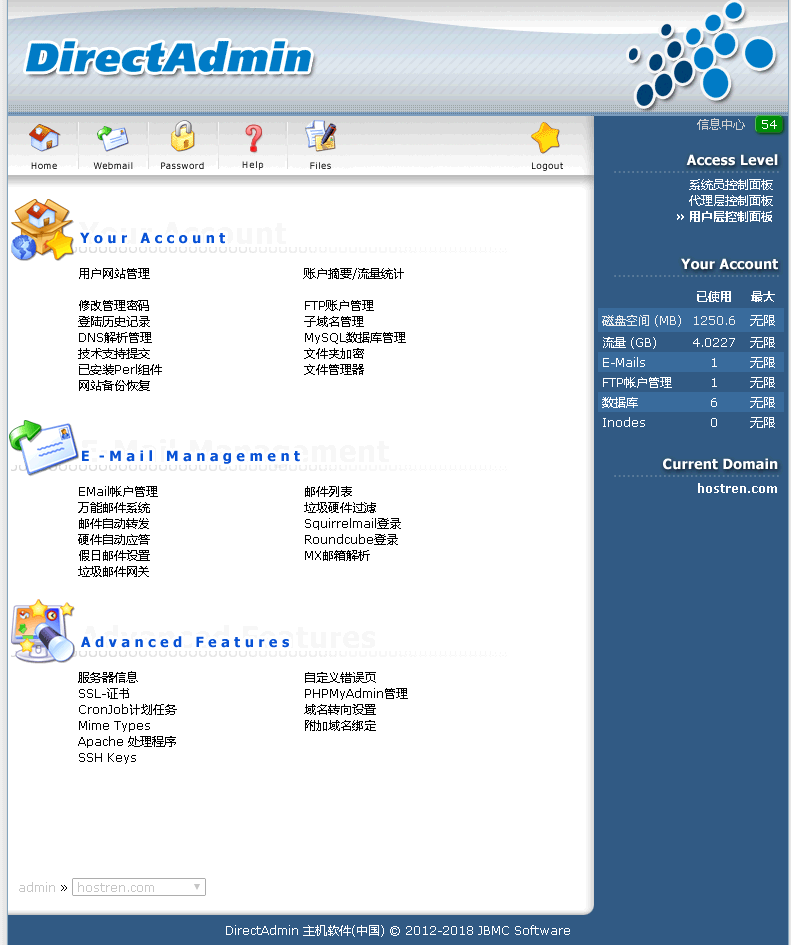
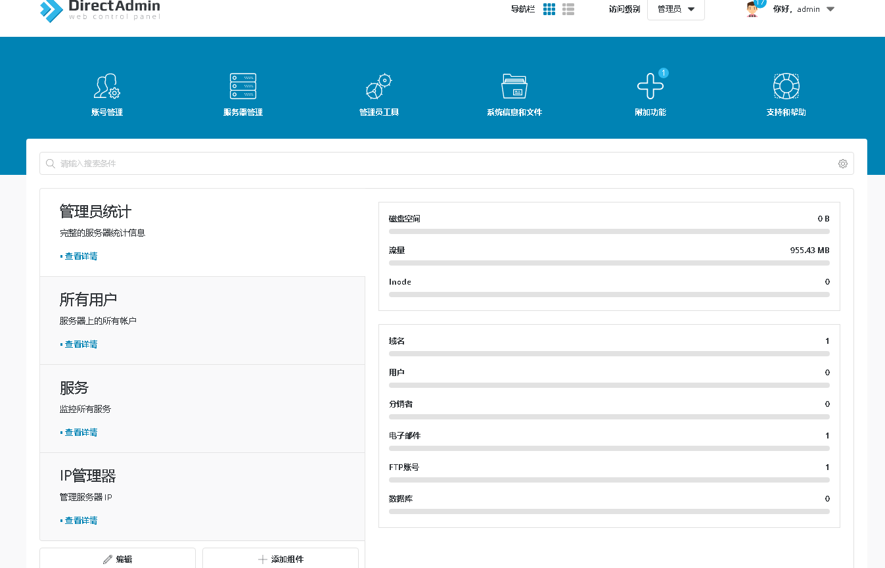

# DirectAdmin Enhanced/Evolution 简体中文语言包	  

**2020年5月,DA官方已经将Evolution作为默认风格,我们已升级至支持最新的版本**	 
**特别注意: 2021年起, Enhanced模板的语言包不在更新**
  
    本语言包均为 [主机软件](http://www.hostsoft.cn "主机软件") 原创手工混合翻译 (部分由Deepl.com机器翻译和Poedit建议自动完成)	  
    原本仅提供给购买我们授权的客户内部使用的, 现在免费提供给非授权的公众客户使用	  
    **因为一些原因我们Github库可能未及时更新,请见谅**	  
    授权客户可以在QQ群或者客户中心下载,没影响	  

## DirectAdmin授权	

我们从**2007**年开始提供cPanel/DirectAdmin/WHMCS/Solusvm/Onapp授权以及定制和周边开发相关的服务	  
如果有需要购买 DirectAdmin License的,找我们,老品牌不跑路,修改授权IP随叫随到	  
请在我们的官方网站 [点击这里到成立于2007年的主机软件官方网站购买](http://www.hostsoft.cn)	    
  
## 当前版本	
* DirectAdmin 最新软件 版本     系列
* DirectAdmin 中文语言 版本  **1.62.4**

我们会一直与官方同步,最后更新 2021/07/30

## 截图预览
| Enhanced风格  | Evolution风格(DA默认)  |
| :------------: | :------------: |
|    |   |


## 安装方式
```bash

#### Install Git / 安装 GIT
yum install -y git

#### clean old lang files / 删除旧的文件
rm -rf /usr/local/directadmin/data/skins/enhanced/lang/cn
rm -rf /usr/local/directadmin/data/skins/evolution/lang/zh_Hans
rm -rf /usr/local/directadmin/data/skins/evolution/lang/login-zh_Hans.*
rm -rf /usr/local/directadmin/data/skins/evolution/lang/zh_Hans.*


#### Clone lang package / 克隆我们的语言包
cd /opt
[ -d "/opt/hostsoft" ] && rm -rf /opt/hostsoft
git clone https://github.com/hostsoft/diretcadmin-chinese-lang hostsoft

#### Copy File / 复制文件

##### Enhanced / 风格中文语言包
cp -Rp /opt/hostsoft/enhanced/lang/cn /usr/local/directadmin/data/skins/enhanced/lang/

##### Evolution / 风格中文语言包
cp -Rp /opt/hostsoft/evolution/lang/zh_Hans.* /usr/local/directadmin/data/skins/evolution/lang/
cp -Rp /opt/hostsoft/evolution/lang/login-zh_Hans.* /usr/local/directadmin/data/skins/evolution/lang/
cp -Rp /opt/hostsoft/evolution/lang/zh_Hans /usr/local/directadmin/data/skins/evolution/lang/

#### Modify permission / 修改文件权限
chown diradmin:diradmin -R /usr/local/directadmin/data/skins/enhanced/
chown diradmin:diradmin -R /usr/local/directadmin/data/skins/evolution/

#### Bulk reset all user lang value / 批量设置所有用户为中文语言 (可选)
perl -pi -e 's/language=en/language=cn/' /usr/local/directadmin/data/users/*/user.conf


```
